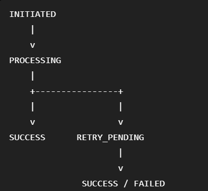
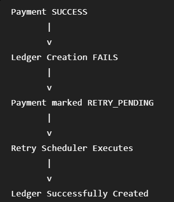

# **FinTech Payment Service**

A payment processing system built using Java, Spring Boot, and PostgreSQL that demonstrates core financial system concepts including idempotent payment processing, double-entry ledger accounting, failure recovery, and reconciliation workflows.

## Features

### Payment Processing

* Create and process payments through REST APIs
* Persistent payment lifecycle management
* State-based workflow handling

### Idempotency

* Prevents duplicate payment creation using idempotency keys
* Ensures safe retries from clients

### Double-Entry Ledger

* Creates debit and credit entries for every successful payment
* Maintains financial consistency and auditability

### Failure Recovery

* Handles downstream ledger failures gracefully
* Controlled retry mechanism with retry tracking and scheduling

### Reconciliation

* Detects inconsistencies between payments and ledger entries
* Supports operational monitoring and recovery workflows

### Validation & Error Handling

* Request validation using Jakarta Validation
* Centralized exception handling using ControllerAdvice

### API Documentation

* OpenAPI / Swagger integration

## Architecture

                    +----------------+
                    |    Client      |
                    +--------+-------+
                             |
                             v
                    +----------------+
                    | Payment API    |
                    +--------+-------+
                             |
               +-------------+-------------+
               |                           |
               v                           v

      +----------------+        +----------------+
      | Payments Table |        | Ledger Service |
      +----------------+        +-------+--------+
                                        |
                                        v
                              +------------------+
                              | Ledger Entries   |
                              +------------------+

                                        ^
                                        |
                              +------------------+
                              | Retry Scheduler  |
                              +------------------+

                                        ^
                                        |
                              +------------------+
                              | Reconciliation   |
                              +------------------+

## Payment Lifecycle

## Database Design
### Payments

| Column             | Description                 |
| ------------------ | --------------------------- |
| id                 | Payment identifier          |
| amount             | Transaction amount          |
| sourceAccount      | Debit account               |
| destinationAccount | Credit account              |
| idempotencyKey     | Duplicate prevention        |
| status             | Payment status              |
| ledgerCreated      | Ledger completion indicator |
| retryCount         | Retry tracking              |
| nextRetryAt        | Retry scheduling            |

### Ledger Entries

| Column    | Description             |
| --------- | ----------------------- |
| id        | Ledger entry identifier |
| paymentId | Associated payment      |
| account   | Account involved        |
| amount    | Entry amount            |
| type      | DEBIT / CREDIT          |
| createdAt | Entry timestamp         |

## Failure Handling

Example Scenario

This design demonstrates eventual consistency while preserving payment records.

## Reconciliation

The reconciliation endpoint identifies payments that have not been fully recorded in the ledger.

Example:

GET /reconciliation/mismatches

Returns payments requiring operational attention.

### Running locally

Create database:
CREATE DATABASE fintech_payment_service;

* spring.datasource.url=jdbc:postgresql://localhost:5432/payments
* spring.datasource.username=postgres
* spring.datasource.password=my_pwd

Commands:

mvn clean install
mvn spring-boot:run

Start PostgresSQL locally
The port runs on 8080

### API Documentation

Swagger UI: http://localhost:8080/swagger-ui/index.html

### Future Improvements

* Event-driven ledger processing
* Kafka-based retry orchestration
* Advanced reconciliation checks
* Metrics and monitoring integration

## Key Concepts Demonstrated

* Spring Boot REST APIs
* PostgreSQL persistence
* Idempotent payment processing
* Double-entry ledger accounting
* Transaction management
* Retry workflows
* Eventual consistency
* Reconciliation
* Validation and exception handling
* API documentation